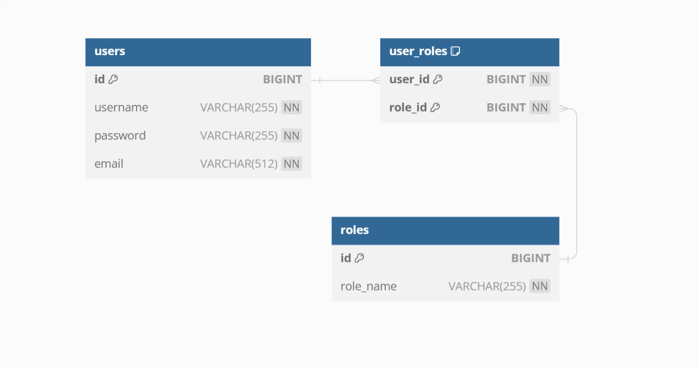

## springbootsecurityt1

### Описание проекта
Веб-приложение с использованием Spring Security и JWT для аутентификации и авторизации пользователей.
Учебный проект по заданию от T1 образовательной школы по Java направлению.

### Стэк проекта
* Java 17, Spring Boot (Web, Security, JPA, AOP), JJWT, PostgreSQL, Swagger, Lombok, Junit5

### Содержание:
1. [Техническое задание](#техническое-задание)
2. [API сервиса](#api-сервиса)
3. [Валидация регистрационных данных](#регистрация-пользователей-валидация)
4. [Схема базы данных](#схема-базы-данных)
5. [Ссылки](#ссылки)
6. [Автор](#автор)

### Техническое задание
* [Тех-задание](docs/4.txt)

### API сервиса
UI. Запустите сервис и перейдите по ссылке: [swagger-ui](http://localhost:8080/swagger-ui.html)

* JSON файл документации: 
[springbootsecurityt1_specification](docs/springbootsecurityt1-openApi-specification.json)

### Регистрация пользователей (валидация)
* В проекте используется Spring AOP для валидации входных регистрационных данных.

##### Ограничения:
1. Логин (допускается использовать кириллицу, цифры. Остальные символы запрещены)
2. Email (формат почтового адреса: example@example.example)

### Схема базы данных

### Ссылки
1. Используемые зависимости: [pom.xml](pom.xml)
2. Настройки проекта: [application.properties](src/main/resources/application.properties)
3. Схема базы данных: [schema.sql](src/main/resources/schema.sql)
4. Тесты: [springbootsecurityt1-test](src/test/java/ru/koryruno/springbootsecurityt1)

### Автор
* KoryRunoMain